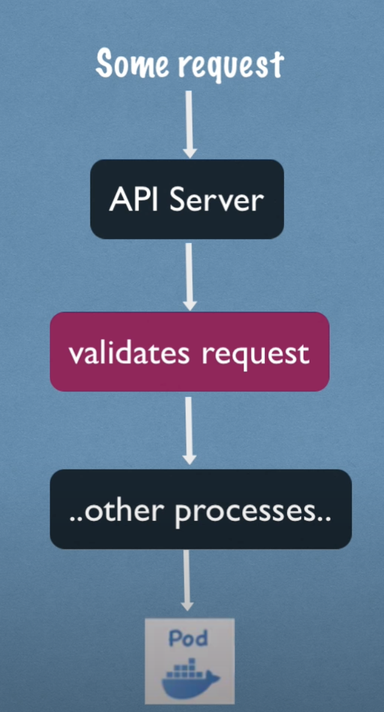

[← Contents](./README.md)

# Architecture

To achieve an architecure to provide the bases of distibuted services, the services which provides this possibility iteself needs to be a distributed service. This is why it doesn't really make sense to use a cluster where there is only one master or one worker node. To achieve distribution there must be at least two workers and two masters. That said, it is possible to run a kubernetes cluster with only one master and workernwhich in my opinion only makes sense in development or practice environments. An alternative for both would be [minikube](https://minikube.sigs.k8s.io/docs/start/) as it requires less setup and gets you going faster.

## Hardware requirements

Since all the applications are running on the worker nodes, the nodes will probably need more resources then the master nodes, as these only really come into play if something doesn't work right or a request from a client is made. The hardware of the worker nodes therefore should be dependent on what you are going to run on them.

## Master

Masters are responsible for deciding where to start new [pods](components/pod.md), it is responsible for monitoring [pods](components/pod.md) and re-starting them if they for some reason die. Masters are also responsible to manage nodes that are members of the cluster and provide the logic to add and remove nodes to the cluster. How you can do this is described in the [bootsrap tokens documentation](cluster-management/bootstrap-tokens.md). To accomplish all of this a master node has to have for running processes:

*all of these process are installed if you follow the [installation documentation](./installation.md)*

### API server

The API server is used to interact with the cluster as a k8s client. Everytime you execute a ```kubectl``` command a request to the k8s API server is made. The API server is described aas a cluster gateway, because it is responsible to get any updates to the cluster or queries from the cluster.

The API server is also responsible for handling the authentication and authorization of the incoming requests.



This means every interaction with the cluster as a user is made over the API server.

This system is also favorable for security since there is only one possibility to interact with the cluster.

### Scheduler

The master scheduler is responsible for handling the requests to schedule new [pods](components/pod.md) which then get deployed on the [worker nodes](./components/node.md). The master scheduler has a intelligent system on where to deploy the [pods](components/pod.md). The deployment process for the requested [components](./components/) (in this case a [pod](components/pod.md)) is intellegent and decides on where to put the pod based on the following criteria:

* How much resources will the [pod](./components/pod.md) use
* How many resources are available on what worker node

The scheduler than schedules the [pod](components/pod.md) on the [node](components/node.md) with the most resources unoccupied where the resources requested from the [pod](components/pod.md) can be provided.

The schduler only decides on where to deploy the [pod](components/pod.md), the actual startup of the pod and containers is handled by kubelet on the [worker node](components/node.md).

### Controller manager

The controller manager can detect when [pods](components/pod.md) die on the [worker nodes](components/node.md). It does not only detect if [pods](components/pod.md) die, it detects all state changes of the cluster. If now f.ex. a [pod](components/pod.md) crashes the controller manager will try to restore the state of the cluster right before that crash occured. The controller manager does not schedule [pods](components/pod.md) by itself. It also makes a request to the scheduler on the master node, which then schedules the pod as usual.

### etcd

This services is nothing more then a key-value store for the cluster state. Because everything that happens in the cluster is stored in the cluster, f.ex. if you schedule a new [pod](components/pod.md) this information will be stored in etcd, etcd is called "the brain" of the cluster. It servers as the single point of truth for all cluster operations. If the scheduler wants to schedule a new [pod](components/pod.md), it gets the required inforamtion about the requested [pod](components/pod.md) resources and the availble [node](components/node.md) resources from etcd. Data which is processed inside [pods](components/pod.md) f.ex. if you have a [statefulset](components/stateful-set.md) of database [pods](components/pod.md). This data is not stored inside etcd. Etcd only contains inforamtion about the cluster state. Only processes from k8s directly use etcd.

### Multiple masters

If there are multiple master nodes are present the API server will automatically be load balanced and the etcd store will automatically be made into a distributed storage across all masters.

## Worker (Node)

Nodes are the the "workers" in the k8s architecture. One node can execute multiple pods. A k8s worker node has three processes installed, which are used to schedule and manage the running pods on the node. These processes are:

*all of these process are installed if you follow the [installation documentation](./installation.md)*

### Container runtime

This can be any container runtime supported by kubernetes. it is used to execute the containers which are executed inside of the [pods](../kubernetes-learn-docs/components/pod.md).

### Kubelet

Kubelet is a software provided by kubernetes and is responsible for starting the [pods](../kubernetes-learn-docs/components/pod.md). It interacts with both the container-runtime and the [node](../kubernetes-learn-docs/components/node.md). Kubelet is also responsible to provide the resources of the node to the pods (CPU, Memory, etc.)

### Kube proxy

Kube-proxy is a software provided by kubernetes and is responsible to proxy request from [services](./components/service.md) to [pods](./components/pod.md). The logic of kube-proxy is "intelligent". This is needed to ensure a performant communication with low overhead. If for example you have an application pod running on node-1 kube-proxy will not forward a database request to node-2 if the requested [service](components/service.md) has a pod on node-1.