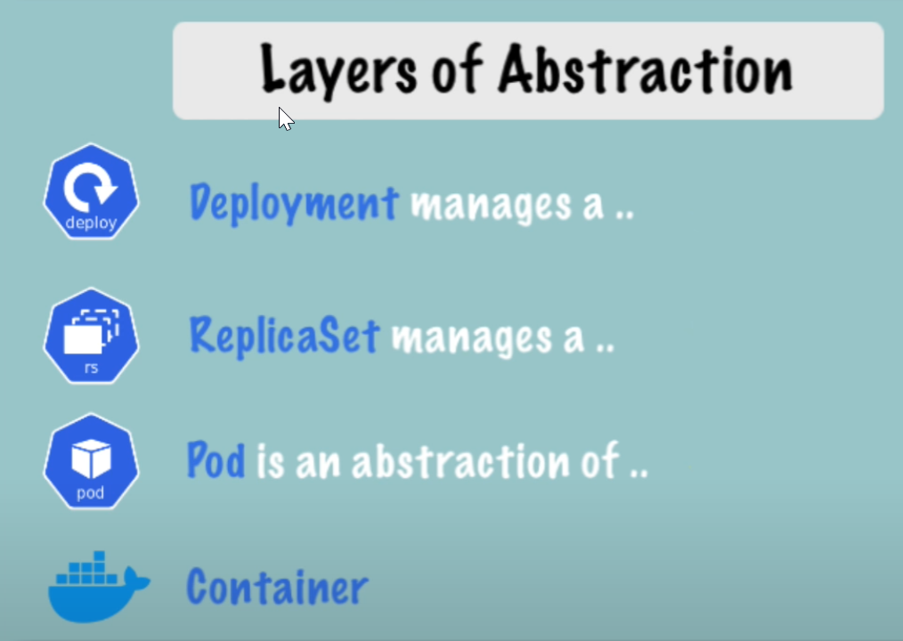

[← Contents](../README.md)

# Deployment

Deployments are blueprints the service you want to provide with your k8s cluster. Deployments are the thing a kubernetes user creates, because it allows us to automate the creation of other components such as [pods](./pod.md).

## Databases

Databases instances cannot and shouldn't be replicated with deployments, because all instances would have to access the same shared persistent data, which can lead to data inconsistencies. If you want to replicate database pods you will have to use [tatefulSets](./stateful-set.md).

## Abstraction layers

