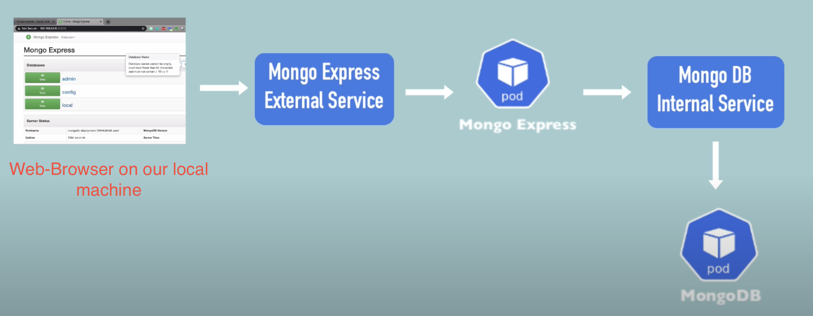

[← Contents](../../README.md)

# MongoDB and MongoExpress example

In this example we are going to setup a service with kubernetes that will provide a [MongoDB](https://www.mongodb.com/) service and a [MongoExpress](https://github.com/mongo-express/mongo-express) service that we can access from our client.

[MongoDB](https://www.mongodb.com/) is a NoSQL Database and [MongoExpress](https://github.com/mongo-express/mongo-express) is a admin interface for MongoDB](https://www.mongodb.com/) written in Node.js.

These applications where chosen because it displays the most basic web-app infrastructure. A web-app and a corresponding database where the web-app can store it's data.

We are not working with [statefulSets](../../components/stateful-set.md) here. SO our aaplication will completly loose all data if our mongodb deployment shuts down for whatever reason.

## Needed components

* 2 [Deployments](../../components/deployment.md) (MongoDB, MongoExpress)
* 2 [Services](../../components/service.md) (Web-app external, Database internal)
* 1 [ConfigMap](../../components/config-map.md) (Database connection data for the web-app)
* 1 [Secret](../../components/secrets.md) (Database credentials to authorize database requests)

The [MongoExpress](https://github.com/mongo-express/mongo-express) pod accepts the Databse connection data as environment variables.

## Request flow



## Creating component configurations

All configurations mentioned in this page con be found [here](./../../configurations/mongodb-service/README.md).

To apply any of these files simply use:

```bash
kubectl apply -f <PATH_TO_CONFIG_FILE>
```

### Secrets

[**READ FIRST**](../../components/secrets.md)

Our secrets are stored in the [app-secrets.yaml](../../configurations/mongodb-service/app-secrets.yaml) file. This file is ready to be applied. The plaintext behind the base64 encoded value are the values as plain strings. This should also never be the case unless your doing somthing like a learning documentation.

In our case we need to supply our components with a database user and a database apssword for this user. This secret can be used by multiple components, so we onyl need to create one secret for both the mongodb deployment and the mongoexpress deployment. Note the [password rules for MonogDB](https://docs.mongodb.com/manual/reference/connection-string/).

```yaml
apiVersion: v1
kind: Secret
metadata:
  name: mongodb-secrets
type: Opaque
data:
  dbUsername: YWRtaW4=                # admin
  dbPassword: YWRtaW43ODE9UGFzcw==    # admin781=Pass
```

We can now apply this file to our cluster.

Now we can check if our secrets got properly registered:

```bash
kubectl get secret mongodb-secrets
```

### MongoDB deployment

We first need to define a basic deployment. Since we now the [MongoDB](https://www.mongodb.com/) container image can be pulled from [Docker Hub](https://hub.docker.com/_/mongo) with the name ```mongo``` our basic deployment file will look like this:

```yaml
apiVersion: apps/v1
kind: Deployment
metadata:
  name: mongodb-depl
  labels:
    app: mongodb
spec:
  replicas: 1
  selector:
    matchLabels:
      app: mongodb
  template:
    metadata:
      labels:
        app: mongodb
    spec:
      containers:
      - name: mongodb
        image: mongo
```

Now we need to check out what configuration is needed for our mongodb container to run correctly. The doumentation for this container image is also found on [Docker Hub](https://hub.docker.com/_/mongo). In this case we will need to know which port we should open in the pod, because our service needs to be able to connect to our pods.

```yaml
...
spec:
  replicas: 1
  selector:
    matchLabels:
      app: mongodb
  template:
    metadata:
      labels:
        app: mongodb
    spec:
      containers:
      - name: mongodb
        image: mongo
        ports:
        - containerPort: 27017
```

On the Docker Hub page it also states that we need to pass 2 environment variables to create our admin user. These variables are:

* MONGO_INITDB_ROOT_USERNAME
* MONGO_INITDB_ROOT_PASSWORD

We can now add these to our container specification. Note that we are leaving the values of the variables empty for now. The reason for this is, that this configuration file will be uploaded to a repository ([secrets](../../components/secrets.md) do not belong in your code!). Because of this we already have created a [secret](../../components/secrets.md). Since this is a documentation on learning how ot use k8s, our [secrets](../../components/secrets.md) will still be available in the repository.

It is also important to create the secrets before creating our deployment because if we do not do this our deployment will fail to reference the mentioned secrets in it's configuration, since the referenced secrets don't exist yet.

**NOTE AGAIN: DO NOT PUT YOUR SECRECTS INTO YOUR CODE**

```yaml
...
spec:
  containers:
  - name: mongodb
    image: mongo
    ports:
    - containerPort: 27017
    env:
    - name: MONGO_INITDB_ROOT_USERNAME
      value:
    - name: MONGO_INITDB_ROOT_PASSWORD
      value:
```

Referncing the secrets can be done like so:

```yaml
env:
- name: MONGO_INITDB_ROOT_USERNAME
valueFrom:
  secretKeyRef:
    name: mongodb-secrets                   # Name you gave the secrets component
    key: dbUsername                         # Key specified inside the data property of the secret
- name: MONGO_INITDB_ROOT_PASSWORD
valueFrom:
  secretKeyRef:
    name: mongodb-secrets                   # Name you gave the secrets component
    key: dbPassword                         # Key specified inside the data property of the secret
```

Notice that we chaged ```value``` to ```valueFrom```.

We can now apply this file to our cluster.

Check if our deployment got properly applied:

```bash
kubectl get deployment mongodb-depl
```

And if our pods are running correctly:

```bash
kubectl get pod
```

### MongoDB service

The k8s service we are creating here is required to let our other pods communicate with our mogodb pod. We do not want this service to be reachable from outside our k8s cluster.

We're going to start our service configuration file with a minimalistic service config:

```yaml
apiVersion: v1
kind: Service
metadata:
  name: mongodb-service
spec:
  selector:
    app: mongodb                # Label of our deployment
  ports:
    - protocol: TCP
      port: 27017               # We use the same port in our service for convenience
      targetPort: 27017         # Same port as we opened in our pod
```

But instead of putting it into a new file, we can just add this to our existing [```monogodb-app.yaml```](../../configurations/mongodb-service/mongodb-app.yaml) file. To do this we have to add
```---``` to a new line after our deployment

```yaml
...
        - name: MONGO_INITDB_ROOT_PASSWORD
          valueFrom:
            secretKeyRef:
              name: mongodb-secrets                   # Name you gave the secrets component
              key: dbPassword                         # Key specified inside the data property of the secret
---
apiVersion: v1
kind: Service
metadata:
  name: mongodb-service
spec:
...
```

It makes sense to do this for a service and deployment as they usually belong together. Again we should not do this with secrets as they shouldn't be stored inside of a repository.

We can now apply this file to our cluster.

Check if our service got properly applied:

```bash
kubectl get service mongodb-service
```

Now check if our service endpoints match with the pod IP(s)

```bash
kubectl get pod -o wide && kubectl describe service mongodb-service
```

### MongoExpress app

The full deployment and serice file can be dounf [here](../../configurations/mongodb-service/mongoexpress-app.yaml)

At first we're again going to create a basic deployment file:

```yaml
apiVersion: apps/v1
kind: Deployment
metadata:
  name: mongo-express-depl
  labels:
    app: mongo-express
spec:
  replicas: 1
  selector:
    matchLabels:
      app: mongo-express
  template:
    metadata:
      labels:
        app: mongo-express
    spec:
      containers:
      - name: mongo-express
        image: mongo-express
```

We will again have to find out on which port mongo-express will be served inside of the container. This again is provided in the description of the image on [Docker Hub](https://hub.docker.com/_/mongo-express)


```yaml
...
spec:
  containers:
  - name: mongo-express
    image: mongo-express
    ports:
    - containerPort: 8081
```

Now to the configuration of the mongo-express container. The possible environment variables to configure the applciation can also be found in the description of the image on [Docker Hub](https://hub.docker.com/_/mongo-express)

The variables we need to set are:

* ME_CONFIG_MONGODB_SERVER
* ME_CONFIG_MONGODB_ADMINUSERNAME
* ME_CONFIG_MONGODB_ADMINPASSWORD

Now we can utilize the already created secret. The username and password can be set like this in our deployment:

```yaml
...
env:
- name: ME_CONFIG_MONGODB_ADMINUSERNAME
  valueFrom:
    secretKeyRef:
      name: mongodb-secrets                   # Name you gave the secrets component
      key: dbUsername   
- name: ME_CONFIG_MONGODB_ADMINPASSWORD
  valueFrom:
    secretKeyRef:
      name: mongodb-secrets                   # Name you gave the secrets component
      key: dbPassword   
...
```

For the ```ME_CONFIG_MONGODB_SERVER``` variable we want to use a configMap. This has the same advantage as storing out credentlias in a secret; multiple components can use it.

#### MongoExpress configmap

[Read about config maps](../../components/config-map.md)

In this configmap we just need to store our ```databaseUrl``` which we wan tot pass as an environment variable to our mongo-express deployment. This can be achieved with [this file](../../configurations/mongodb-service/monogoexpress-configmap.yaml).

```yaml
apiVersion: v1
kind: ConfigMap
metadata:
  name: mongodb-configmap
data:
  databaseUrl: mongodb-service
```

As you can see, we can just use our mongodb service name as the ```databaseUrl``` k8s will handle the name resolution for us. We need to apply this file bofore we can apply our deployment and service. To do so execute:

```bash
kubectl apply -f monogoexpress-configmap.yaml
```

Now check if the configmap was registered successfully:

```bash
kubectl get configmap mongodb-configmap
```

Now we can continue to add our environment variables to our deployment:

```yaml
...
env:
- name: ME_CONFIG_MONGODB_SERVER
  valueFrom:
    configMapKeyRef:
      name: mongodb-configmap                  # Database Url provided by the config map
      key: databaseUrl   
- name: ME_CONFIG_MONGODB_ADMINUSERNAME
  valueFrom:
    secretKeyRef:
      name: mongodb-secrets                   # Name you gave the secrets component
      key: dbUsername   
- name: ME_CONFIG_MONGODB_ADMINPASSWORD
  valueFrom:
    secretKeyRef:
      name: mongodb-secrets                   # Name you gave the secrets component
      key: dbPassword   
...
```

After the deployment is finished we can check if the deployment actually works by applying the file and checking on our deployment and pod:

```bash
kubectl apply -f mongoexpress-app.yaml
```

```bash
kubectl get deployment mongo-express-depl
```

```bash
kubectl get pod
```

If everythign is running successfully we can now continue to create the external service.

#### External service

For this add a new section with the basic service template in the [```monogoexpress-app.yaml``` file](../../configurations/mongodb-service/mongoexpress-app.yaml).

```yaml
...
---
apiVersion: v1
kind: Service
metadata:
  name: mongo-express-service
spec:
  selector:
    app: mongo-express
  ports:
    - protocol: TCP
      port: 8081
      targetPort: 8081
```

Now me have to make this service an external service. This can be done by adding the following property to the ```spec:``` property and adding the ```nodePort``` property to our ports:

```yaml
...
spec:
  selector:
    app: mongo-express
  type: LoadBalancer
  ports:
    - protocol: TCP
      port: 8081
      targetPort: 8081
      nodePort: 30000
...
```

If you want to know why we have to declare the type as ```LoadBalancer``` and why this name is quiet misleading [read more here](../../components/service.md).

We also need to add a ```nodePort``` property to our ports to tell k8s on which port the service should be exposed on the worker node iteself.

Let's apply our deployment and service to check if everything worked as expected.

```bash
kubectl apply -f mongoexpress-app.yaml
```

Check our service:

```bash
kubectl get service mongo-express-service
```

Check our deployment:

```bash
kubectl get deployment mongo-express-depl
```

Check our pod:

```bash
kubectl get pod
```

Before we can access our service there is a last step depending on where you are running your k8s cluster:

### Minikube

Just execute:

```bash
minikube service mongo-express-service
```

A browser window displying the mongoexpress frontend should automatically open.

Default credentials are:

Username: admin
Password: pass

### EKS or Google Cloud

Your service should already have been assigned a public IP, check this with:

```bash
kubectl get service mongo-express-service
```

If you see a public IP you can access it in the browser.

Host: <YOUR_PUBLIC_IP>:30000

Username: admin
Password: pass

If the IP says 'pending' even afer waiting about 30 - 60 seconds, try the next step.

### The smarter way

The smarter way to do this is to use [ingress](../../components/ingress.md) which was designed to expose services to the public outside of your cluster.